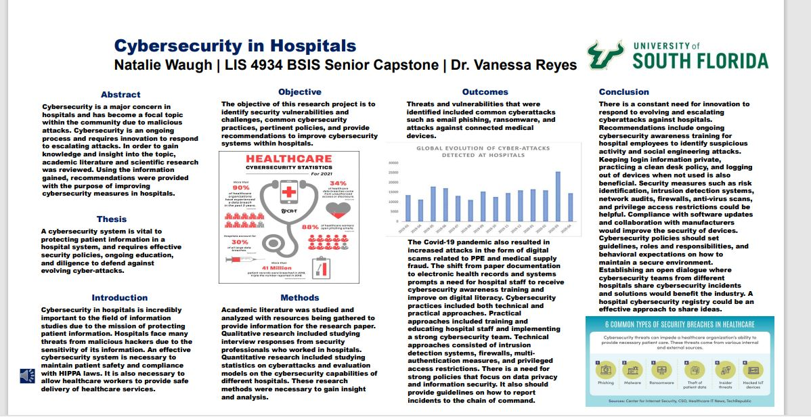

# Senior-Capstone-Cybersecurity

For this project, I wrote a research paper on the importance and impact of cybersecurity in hospitals. Goals for this research project included identifying cybersecurity challenges and vulnerabilities, current cybersecurity practices, pertinent policies, need for ongoing cybersecurity education, and any recommendations. The focus is to explore the landscape of cybersecurity within hospitals and discuss recommendations for improvement. Throughout the paper, research and literature will be examined and analyzed to gain insight into this topic.
Attached are the research paper file and poster presentation.

